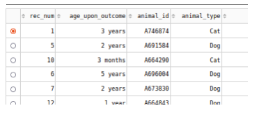

# AnimalCenterDatabase

## Description

Utilizing a MongoDB database and python, with a dash framework provide querries and information regarding the Austin Animal Center. We are provided a starter code template as well as intialized a database with a user and methodology to perform basic crud operations to the imported data. We used pymongo built-in methodology to construct our methods for querries. Dash framework was integrated to provide a front-end layout for the information as well as useful widgets to help display information regarding querries and selection. The lists returned are also sortable allowing for a more friendly user experience. This project was a great combination of implementing a small full stack web application including an interactive front-end. It is important that the account is verified prior to accessing database information as well, and querry to read upon initilization of the applicaiton will fail if authentication isn't passed. In this example it is hardcoded but is important to protect this information and encypt in a professional setting to protect the database. 

## Installation

Required packages and languages
* MongoDb
* Python
* Pymongo
* Plotly
* Numpy
* Pandas
* Matplotlib
* Dash

## Usage

By running the program we create a user object and initialize the list by performing a read all with a limit of 40 results per page

We can select options from the top of the application to perform specific querries based off of predetermined requirements

We are also provided piechart and geolocation widgets to vizualise specific animal selections and composition of the querry ran

Each column is also sortable to allow more flexibility to the user

## Contributors
myself and starter code provided by cs-340

## License 
MIT
